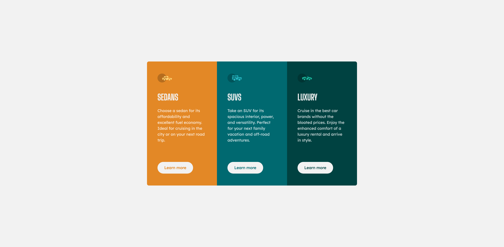

# 3-column-preview-card

Frontend Mentor Challenge - 3 column preview card

## Table of contents

- [Overview](#overview)
  - [The challenge](#the-challenge)
  - [Screenshot](#screenshot)
  - [Links](#links)
- [My process](#my-process)
  - [Built with](#built-with)
  - [What I learned](#what-i-learned)
  - [Accessibility Resources](#accessibility-resources )
  - [Continued development](#continued-development)
- [Author](#author)
- [Acknowledgments](#acknowledgments)

## Overview

### The challenge

Users should be able to:

- View the optimal layout depending on their device's screen size
- Page should be responsive.
- See hover states for all interactive elements on the page

### Screenshot

### Links

- Solution URL: https://matthew-millard.github.io/3-column-preview-card/

## My process

### Built with

- HTML
- CSS
- Grid
- Flexbox
- Firefox Developers Tools
- VS Code
- Mobile-first workflow
- BEM

### What I learned

- I have attempted to play a bit of code golf with this challenge. Throughout I kept trying to think ahead as to where I could reuse my classes as much as possible.

- Hide content for accessibility. I was previously making the mistake setting `{visibility: hidden;}` Now I do the following:
  `.hidden {position: absolute !important;
    height: 1px;
    width: 1px;
    overflow: hidden;
    clip: rect(1px 1px 1px 1px);
    clip: rect(1px, 1px, 1px, 1px);}`

### Accessibility Resources 

- 

- 

- 

### Continued development

- Accessibility practise.
- Keep trying to write efficent and readable code.
- Make an effort to add comments in the code.
- Develop a better workflow.

## Author

- Frontend Mentor - [@matthew-millard](https://www.frontendmentor.io/profile/matthew-millard)

- Github - [matthew-millard](https://github.com/matthew-millard)

## Acknowledgments

- Kevin Powell - [@kevinPowell](https://www.kevinpowell.co/)

- CSS-TRICKS - [@ChrisCoyier](https://css-tricks.com/logic-in-css-media-queries/)

- Sameer Singh - [@SameerJS6](https://www.frontendmentor.io/profile/SameerJS6) Thanks Sameer for the helpful feedback. It is greatly appreciated.

- Vanza Setia - [@vanzasetia](https://www.frontendmentor.io/profile/vanzasetia) Thanks Vanza for taking the time to give me feeback and point me in the right direction to learn more about accessibility.
